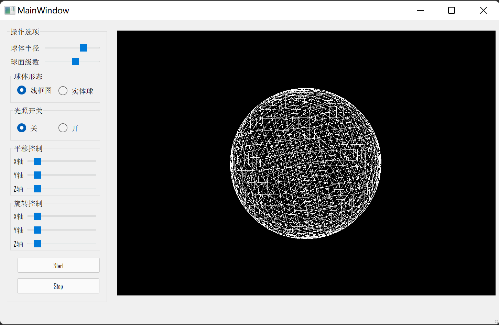
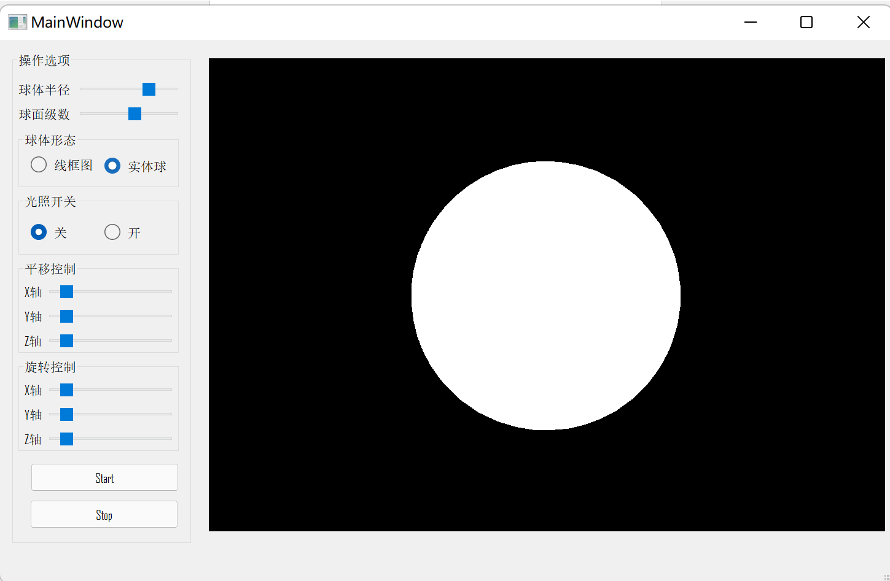
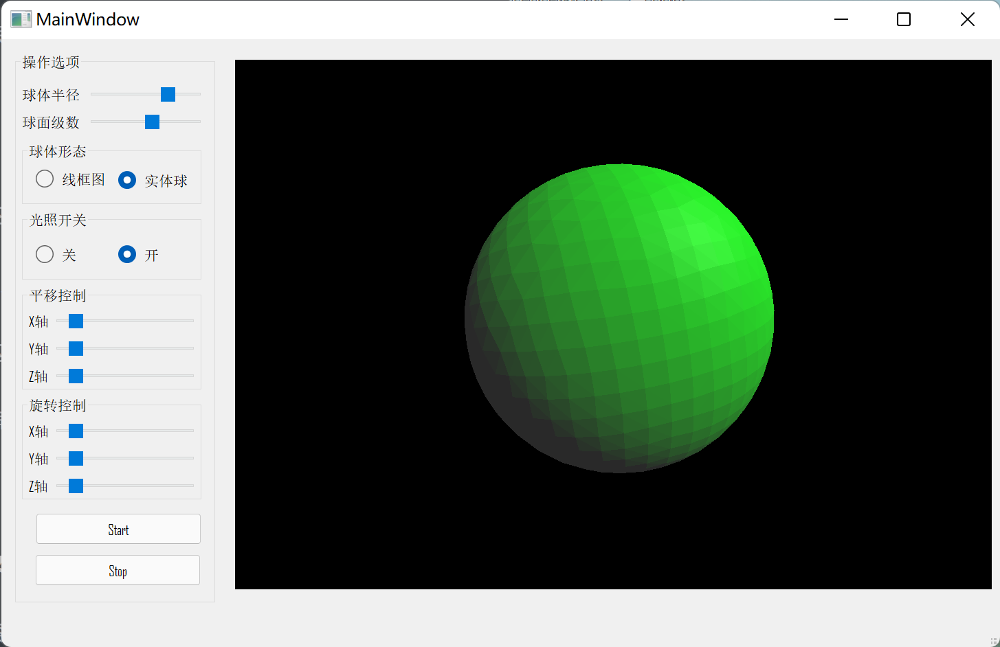
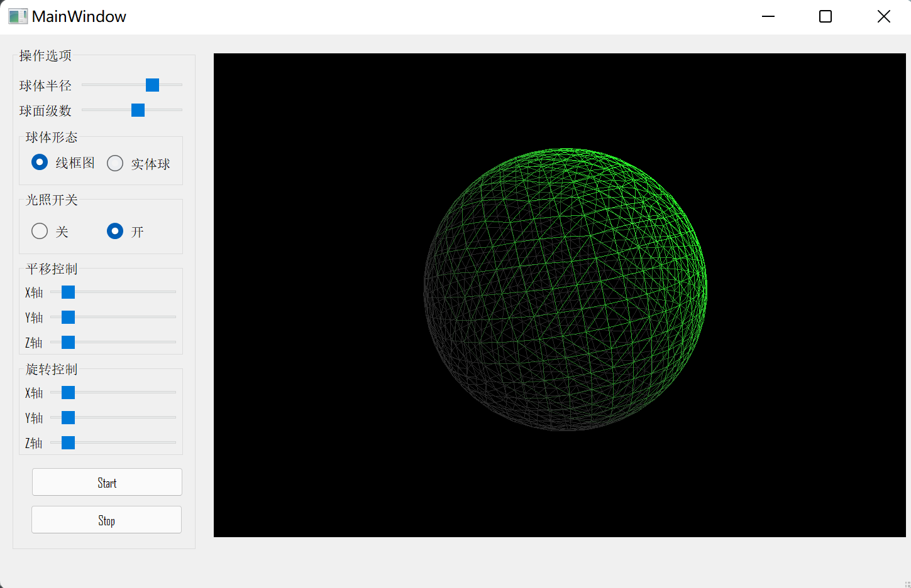
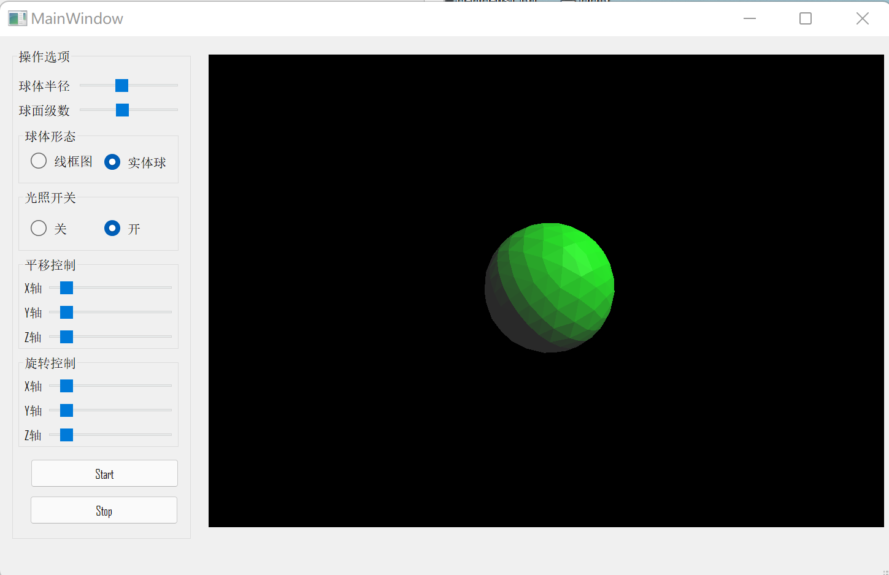
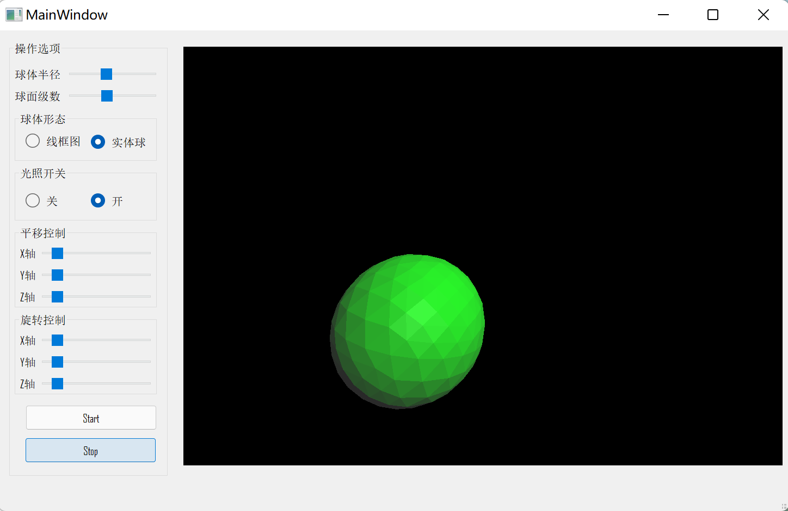

# Computer_Graphics

## Environments

### Interpreter

Python 3.7

### Packages

  * PyQt5               5.15.6
  * PyOpenGL            3.1.5
  * PyOpenGL-accelerate 3.1.5
  * numpy               1.21.4
  * opencv-python       4.5.4.60
  * image               1.5.33
  * Pillow              8.4.0

## Example

### 1. Pentagon to Star

  

### 2. Diamond

  

### 3. BresenhamLines
  
  

### 4. Padding
 
   
   
   
   
   

   
### 5. wu_bresenham_Lines
   
   

### 6. Cohen_Sutherla

   
  
### 7. 3Dball

   
   
   
   
   
   
   
   
   
   
   
   
   

### 8. SolarSystem

  
